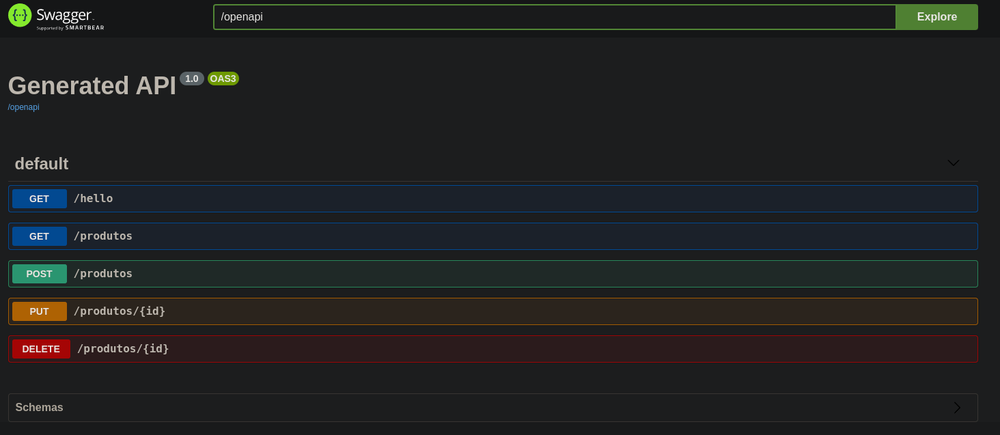

# API - Quarkus ToDo

 
## 💻 Projeto
Projeto Projeto Estruturado a partir dos conceitos básicos para uma aplicção inicial usando quarkus.
 
## Tecnologias

Esse projeto foi desenvolvido com as seguintes tecnologias:

-   JavaSE 11
-   Quarkus
-   MongoDB

## Swagger 

Documantação

#### Tela documentação Swagger.

